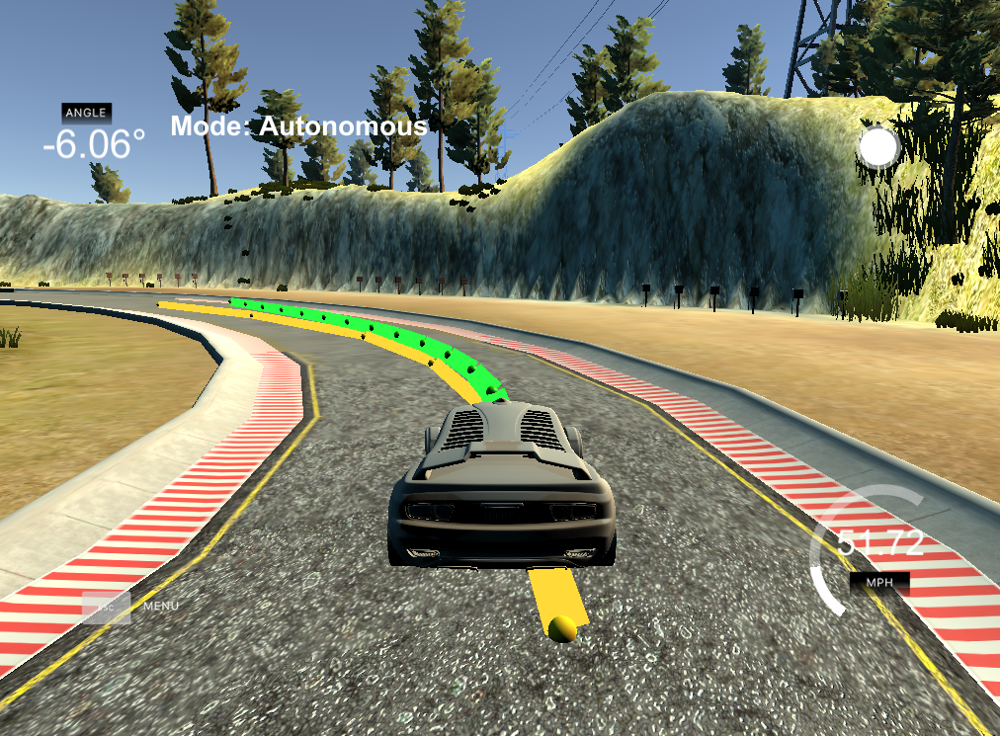

# MPC car controller

This repository contains a C++ implementation of model predictive control (MPC),
which drives a car around a track simulation.

## Implementation

### Model

The model takes into account the car's state, consisting of the following
inputs received from the simulation in [main.cpp](src/main.cpp#L86):
* Position, *x*, *y*;
* Orientation, *ѱ* in radians; and
* Velocity, *v*.

The car is controlled using the actuators:
* Throttle, *a*; and
* Steering angle, *δ*.

The equations of model are implemented in the `FG_eval` class within
[MPC.cpp](src/MPC.cpp#L113):
* *xt+1 = xt + vt cos(ѱt) dt* ;
* *yt+1 = yt + vt sin(ѱt) dt* ;
* *ѱt+1 = ѱt + vt δ dt / Lf*, where
*Lf* is a physical parameter of the vehicle; and
* *vt+1 = vt + at dt* .

MPC predicts the future motion of the vehicle using these model equations,
and solves for the values of throttle and steering angle that minimise a cost
function defined [here](src/main.cpp#L86).  This cost function includes terms
that penalise:
* The cross-track-error (cte), i.e. position of the car relative to the ideal
path along the centre of the track;
* The orientation error, i.e. the difference in vehicle orientation versus the
ideal path;
* The velocity error relative to a [pre-defined target](src/main.cpp#L67); and
* Terms that penalise large actuator values and sudden changes - this helps to
provide smooth control.

Inside [main.cpp](src/main.cpp#L98) there is a transformation from map
coordinates to vehicle coordinates, which is applied to the ideal path waypoints
before they fitted to a cubic and passed to the model. This transformation
simplifies the implementation of model because the initial car state is always
{*x, y, ѱ}* = {0, 0, 0} in vehicle coordinates.

### Parameter tuning

Several parameters required tuning to achieve steady vehicle control. At a
target velocity of 60mph, good control can be achieved by setting `N = 15` and
`dt = 0.05`. These provide a balance between good time resolution, predicting
far enough into the future, and computational speed.

Changing `N` and `dt` have the following effects:

| Case          | `N` | `dt` | Effect                                                                    |
|---------------|-----|------|---------------------------------------------------------------------------|
| Base          | 15  | 0.05 | Smooth control.                                                           |
| Increase `N`  | 25  | 0.05 | Model slower to run so occasionally control becomes unstable.             |
| Decrease `N`  | 5   | 0.05 | Vehicle steers off track as the model can't 'see' far enough into future. |
| Increase `dt` | 15  | 0.15 | Predicted path becomes unstable, oscillating across the track.            |
| Decrease `dt` | 15  | 0.01 | Vehicle steers off track as the model can't 'see' far enough into future. |

The model can also be tuned by adjusting the weights of the various components
in the cost function. Specifically:
* The velocity error is less important and carries a lower weight relative to the cross-track and orientation errors; and
* The steering angle value and change carries increased weight to prevent
sudden changes in steering.

### Latency

The model takes into account 100ms of latency between the controller and the
simulation.  This is implemented in the [solver constraints](src/MPC.cpp#L189)
by forcing to the throttle and steering angle to remain unchanged for the
first `delay_steps` of the model simulation. The values immediately
following this constrained period are returned as the commands to the vehicle.
With `dt = 0.05`, 100ms latency is modelled by setting `delay_steps = 2`
[here](src/main.cpp#L68).

## Performance

The MPC controller can drive the car smoothly around the track, and also plots
the ideal vehicle path in yellow along with the MPC model prediction in green.

